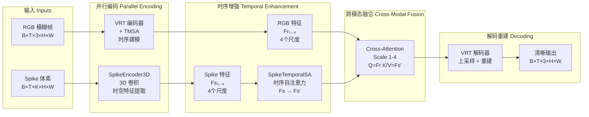
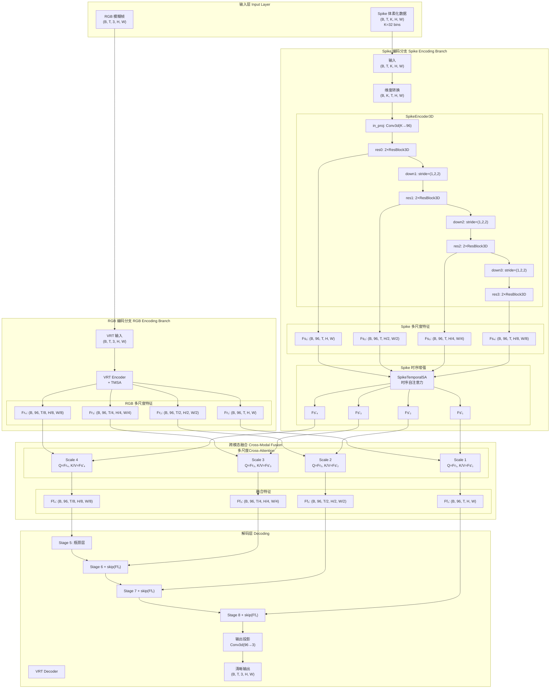

# VRT+Spike 架构完整指南

本文档是 VRT+Spike 视频去模糊模型的完整架构参考，整合了数据流、可视化图表和快速参考信息。

---

## 📋 目录

1. [快速参考](#快速参考)
2. [高层次架构](#高层次架构)
3. [详细数据流](#详细数据流)
4. [各阶段维度变换](#各阶段维度变换)
5. [模块接口规范](#模块接口规范)
6. [配置参数](#配置参数)

---

## 🚀 快速参考

### 一图概览

```
┌─────────────────────────────────────────────────────────────────────────┐
│                      VRT+Spike 视频去模糊架构                              │
└─────────────────────────────────────────────────────────────────────────┘

输入层 INPUTS
═══════════════════════════════════════════════════════════════════════════
  RGB 模糊帧                          Spike 体素化数据
  (B, T, 3, H, W)                    (B, T, K, H, W)
  T=5, H=W=256                       K=32 bins
       │                                    │
       │                                    │
       ▼                                    ▼
───────────────────────────────────────────────────────────────────────────

编码层 ENCODING (并行处理)
═══════════════════════════════════════════════════════════════════════════
┌──────────────────────────┐      ┌──────────────────────────────────────┐
│   VRT RGB 编码器          │      │   Spike 编码器 (SpikeEncoder3D)       │
│   + TMSA 时序建模         │      │   3D 卷积金字塔                       │
├──────────────────────────┤      ├──────────────────────────────────────┤
│ Stage 1: (B,96,T,H,W)    │      │ Scale 1: (B,96,T,H,W)                │
│ Stage 2: (B,96,T',H/2..) │      │ Scale 2: (B,96,T,H/2,W/2)            │
│ Stage 3: (B,96,T'',H/4..)│      │ Scale 3: (B,96,T,H/4,W/4)            │
│ Stage 4: (B,96,T''',H/8.)│      │ Scale 4: (B,96,T,H/8,W/8)            │
└──────────────────────────┘      │          ▼                            │
       │ Fr₁..₄                    │ ┌─────────────────────────────────┐  │
       │                          │ │  SpikeTemporalSA                 │  │
       │                          │ │  Fs₁..₄ → Fs'₁..₄               │  │
       │                          │ └─────────────────────────────────┘  │
       │                          └──────────────────────────────────────┘
       │                                    │ Fs'₁..₄
───────────────────────────────────────────────────────────────────────────

融合层 FUSION (Cross-Attention)
═══════════════════════════════════════════════════════════════════════════
        Fr₁ (RGB) ──┐                Fs'₁ (Spike)
                   ▼                       ▼
        ┌─────────────────────────────────────────┐
        │  TemporalCrossAttnFuse                  │
        │  Q = Fr, K/V = Fs' (沿时间维)           │
        │  MultiheadAttention(heads=4)            │
        └─────────────────────────────────────────┘
                           ▼
                      Ff₁ (融合特征)
        (对4个尺度分别执行: Ff₁, Ff₂, Ff₃, Ff₄)
                           │
───────────────────────────────────────────────────────────────────────────

解码层 DECODING (VRT 解码器 + 跳连)
═══════════════════════════════════════════════════════════════════════════
        Ff₁..₄ → VRT Stage 5 (瓶颈层)
                    ↓
                VRT Stage 6 + skip(Ff₃)
                    ↓
                VRT Stage 7 + skip(Ff₂)
                    ↓
                VRT Stage 8 + skip(Ff₁)
                    ↓
             Conv3d(96→3) 输出投影
                    ↓
          清晰输出 (B, T, 3, H, W)
───────────────────────────────────────────────────────────────────────────
```

### 关键维度

| 层级 | RGB分支 | Spike分支 | 融合后 |
|------|---------|-----------|--------|
| **输入** | `(B,T,3,H,W)` | `(B,T,K,H,W)` K=32 | - |
| **Scale 1** | `(B,96,T,H,W)` | `(B,96,T,H,W)` | `(B,96,T,H,W)` |
| **Scale 2** | `(B,96,T',H/2,W/2)` | `(B,96,T,H/2,W/2)` | `(B,96,T',H/2,W/2)` |
| **Scale 3** | `(B,96,T'',H/4,W/4)` | `(B,96,T,H/4,W/4)` | `(B,96,T'',H/4,W/4)` |
| **Scale 4** | `(B,96,T''',H/8,W/8)` | `(B,96,T,H/8,W/8)` | `(B,96,T''',H/8,W/8)` |
| **输出** | - | - | `(B,T,3,H,W)` |

**注意**: VRT在编码过程中逐渐压缩时间维度 (T → T' → T'' → T''')，而Spike分支保持T不变。

---

## 🏗️ 高层次架构

### 整体设计理念



### 核心设计原则

1. **并行编码**: RGB和Spike各自独立编码，保持模态特异性
2. **时序对齐**: 两个分支都进行时序建模后再融合
3. **多尺度融合**: 在4个不同尺度上分别融合，保留多层次信息
4. **跳连集成**: 融合特征通过跳连直接影响解码过程

---

## 🔄 详细数据流

### 完整Pipeline Mermaid图



---

## 📐 各阶段维度变换

### 1. 输入预处理

```python
# RGB输入
blur_frames: (B, T, 3, H, W)  # T=5, H=W=256

# Spike输入 (从数据集加载)
spike_events: List[(x, y, t, polarity)]  # 原始事件

# 体素化
spike_voxels = voxelize(spike_events, bins=32)  # (B, T, K, H, W), K=32

# 维度转换 (用于SpikeEncoder3D)
spike_input = spike_voxels.permute(0, 2, 1, 3, 4)  # (B, K, T, H, W)
```

### 2. RGB编码 (VRT)

```python
# VRT Stage 1-4 (编码阶段)
x = blur_frames  # (B, T, 3, H, W)

# Stage 1
Fr1 = vrt.stage1(x)  # (B, 96, T, H, W)
# TMSA内部: T个frame之间做temporal attention

# Stage 2 (时间和空间都下采样)
Fr2 = vrt.stage2(Fr1)  # (B, 96, T', H/2, W/2)
# T' 可能小于 T (时间压缩)

# Stage 3
Fr3 = vrt.stage3(Fr2)  # (B, 96, T'', H/4, W/4)

# Stage 4
Fr4 = vrt.stage4(Fr3)  # (B, 96, T''', H/8, W/8)
```

**关键点**: VRT的TMSA会逐渐压缩时间维度，从T → T' → T'' → T'''

### 3. Spike编码 (SpikeEncoder3D)

```python
# 输入
x = spike_input  # (B, K, T, H, W), K=32

# Initial projection
x = in_proj(x)  # Conv3d(32→96, kernel=3, stride=1)
                # (B, 96, T, H, W)

# Scale 1: 原始分辨率
x = res0(x)     # 2×ResBlock3D, (B, 96, T, H, W)
Fs1 = x

# Scale 2: 空间下采样
x = down1(x)    # Conv3d, stride=(1, 2, 2)
                # (B, 96, T, H/2, W/2)
x = res1(x)     # 2×ResBlock3D
Fs2 = x

# Scale 3
x = down2(x)    # (B, 96, T, H/4, W/4)
x = res2(x)
Fs3 = x

# Scale 4
x = down3(x)    # (B, 96, T, H/8, W/8)
x = res3(x)
Fs4 = x

spike_features = [Fs1, Fs2, Fs3, Fs4]
```

**关键点**: Spike编码器只在空间维度下采样，时间维度T保持不变。

### 4. Spike时序增强 (SpikeTemporalSA)

```python
# 输入: [Fs1, Fs2, Fs3, Fs4]
# 每个Fs_i: (B, 96, T, H_i, W_i)

enhanced_features = []
for Fs in spike_features:
    # 转换为 (B, T, 96, H_i, W_i) 用于时序attention
    Fs_btc = Fs.permute(0, 2, 1, 3, 4)
    
    # 时序Self-Attention (沿T维)
    Fs_prime = temporal_self_attention(Fs_btc)
    
    # 转换回 (B, 96, T, H_i, W_i)
    Fs_prime = Fs_prime.permute(0, 2, 1, 3, 4)
    enhanced_features.append(Fs_prime)

# 输出: [Fs'1, Fs'2, Fs'3, Fs'4]
```

### 5. 跨模态融合 (Cross-Attention)

```python
# 对每个尺度
for i in range(4):
    Fr = rgb_features[i]      # (B, 96, T_rgb, H_i, W_i)
    Fs_prime = spike_features[i]  # (B, 96, T, H_i, W_i)
    
    # 转换为 (B, T, 96, H_i, W_i)
    Fr_btc = Fr.permute(0, 2, 1, 3, 4)
    Fs_btc = Fs_prime.permute(0, 2, 1, 3, 4)
    
    # 时序Cross-Attention
    # Q来自RGB, K/V来自Spike
    Ff = cross_attention(Q=Fr_btc, K=Fs_btc, V=Fs_btc)
    
    # 转换回 (B, 96, T_rgb, H_i, W_i)
    Ff = Ff.permute(0, 2, 1, 3, 4)
    fused_features.append(Ff)

# 输出: [Ff1, Ff2, Ff3, Ff4]
```

**关键点**: 
- Q (query) 来自RGB分支，保持RGB的时间维度T_rgb
- K/V (key/value) 来自Spike分支
- 输出维度与RGB分支一致

### 6. VRT解码

```python
# Bottleneck (Stage 5) - 不融合
x = vrt.stage5(Ff4)  # (B, 96, T''', H/8, W/8)

# Stage 6 + skip connection
x = vrt.stage6(x + Ff3)  # (B, 96, T'', H/4, W/4)

# Stage 7 + skip connection
x = vrt.stage7(x + Ff2)  # (B, 96, T', H/2, W/2)

# Stage 8 + skip connection
x = vrt.stage8(x + Ff1)  # (B, 96, T, H, W)

# 输出投影
output = out_proj(x)  # Conv3d(96→3)
                      # (B, 3, T, H, W)
```

---

## 🔌 模块接口规范

### SpikeEncoder3D

```python
class SpikeEncoder3D(nn.Module):
    def __init__(
        self,
        in_channels: int = 32,      # Spike体素bins数量
        base_channels: int = 96,    # 基础通道数，与VRT对齐
        num_scales: int = 4,        # 输出尺度数量
        temporal_strides: List[int] = [1, 1, 1],  # 时间维下采样
        spatial_strides: List[int] = [2, 2, 2],   # 空间维下采样
    ):
        ...
    
    def forward(self, x: torch.Tensor) -> List[torch.Tensor]:
        """
        Args:
            x: (B, K, T, H, W) - Spike体素化输入
        
        Returns:
            List of 4 tensors:
            - Scale 1: (B, 96, T, H, W)
            - Scale 2: (B, 96, T, H/2, W/2)
            - Scale 3: (B, 96, T, H/4, W/4)
            - Scale 4: (B, 96, T, H/8, W/8)
        """
```

### SpikeTemporalSA

```python
class SpikeTemporalSA(nn.Module):
    def __init__(
        self,
        channels_per_scale: List[int],  # 每个尺度的通道数 [96,96,96,96]
        num_heads: int = 4,              # Attention头数
    ):
        ...
    
    def forward(self, feats_list: List[torch.Tensor]) -> List[torch.Tensor]:
        """
        Args:
            feats_list: List of 4 tensors (B, C, T, H_i, W_i)
        
        Returns:
            List of 4 tensors (B, C, T, H_i, W_i) - 增强后的特征
        """
```

### TemporalCrossAttnFuse

```python
class TemporalCrossAttnFuse(nn.Module):
    def __init__(
        self,
        dim: int = 96,        # 特征维度
        heads: int = 4,       # Attention头数
        chunk_size: int = 64, # 空间分块大小（内存优化）
    ):
        ...
    
    def forward(
        self,
        Fr: torch.Tensor,  # (B, T, C, H, W) - RGB特征
        Fs: torch.Tensor,  # (B, T, C, H, W) - Spike特征
    ) -> torch.Tensor:
        """
        Returns:
            Ff: (B, T, C, H, W) - 融合后的特征
        """
```

### MultiScaleTemporalCrossAttnFuse

```python
class MultiScaleTemporalCrossAttnFuse(nn.Module):
    def __init__(
        self,
        channels_per_scale: List[int] = [96, 96, 96, 96],
        heads: int = 4,
    ):
        ...
    
    def forward(
        self,
        Fr_list: List[torch.Tensor],  # RGB特征列表
        Fs_list: List[torch.Tensor],  # Spike特征列表
    ) -> List[torch.Tensor]:
        """
        对每个尺度分别进行Cross-Attention融合
        
        Returns:
            List of 4 fused tensors
        """
```

---

## ⚙️ 配置参数

### 模型配置

```yaml
model:
  type: "VRTWithSpike"
  
  # VRT基础配置
  vrt:
    upscale: 1
    img_size: [256, 256]
    window_size: [2, 8, 8]
    depths: [8, 8, 8, 8, 8, 8, 8]
    indep_reconsts: [9, 10, 11]
    embed_dims: [96, 96, 96, 96, 96, 96, 96]
    num_heads: [6, 6, 6, 6, 6, 6, 6]
    spynet_path: "third_party/VRT/experiments/pretrained_models/flownet/spynet_sintel_final-3d2a1287.pth"
  
  # Spike编码器配置
  spike_encoder:
    in_channels: 32         # 体素bins数量
    base_channels: 96       # 与VRT对齐
    num_scales: 4
    temporal_strides: [1, 1, 1]  # 不压缩时间
    spatial_strides: [2, 2, 2]   # 空间下采样匹配VRT
  
  # Spike时序Self-Attention配置
  spike_temporal_sa:
    channels_per_scale: [96, 96, 96, 96]
    num_heads: 4
    chunk_size: 256         # 自适应分块
  
  # 跨模态融合配置
  fusion:
    type: "MultiScaleTemporalCrossAttnFuse"
    channels_per_scale: [96, 96, 96, 96]
    heads: 4
    chunk_size: 64          # 空间分块优化内存
```

### 数据配置

```yaml
data:
  spike:
    voxel_bins: 32
    normalize: true
    log_transform: true     # log1p变换
    mean: 0.0
    std: 1.0
  
  rgb:
    num_frames: 5           # 每个样本的帧数
    crop_size: 256          # 训练时裁剪尺寸
    augmentation: true      # 数据增强
```

### 训练配置

```yaml
training:
  batch_size: 2
  num_workers: 4
  pin_memory: true
  
  optimizer:
    type: "AdamW"
    lr: 1e-4
    weight_decay: 1e-4
  
  scheduler:
    type: "CosineAnnealingLR"
    T_max: 100000
    eta_min: 1e-7
  
  loss:
    charbonnier_weight: 1.0
    perceptual_weight: 0.1
```

---

## 📚 相关文档

- **验证报告**: `VRT_Spike_验证与实现综合报告.md`
- **快速开始**: `QUICK_START.md`
- **配置详解**: `CONFIG_GUIDE.md`
- **数据加载**: `DATALOADER_GUIDE.md`
- **推理策略**: `验证推理策略详解.md`
- **优化指南**: `OPTIMIZATION_GUIDE.md`

---

**文档版本**: 1.0  
**最后更新**: 2025-10-21


