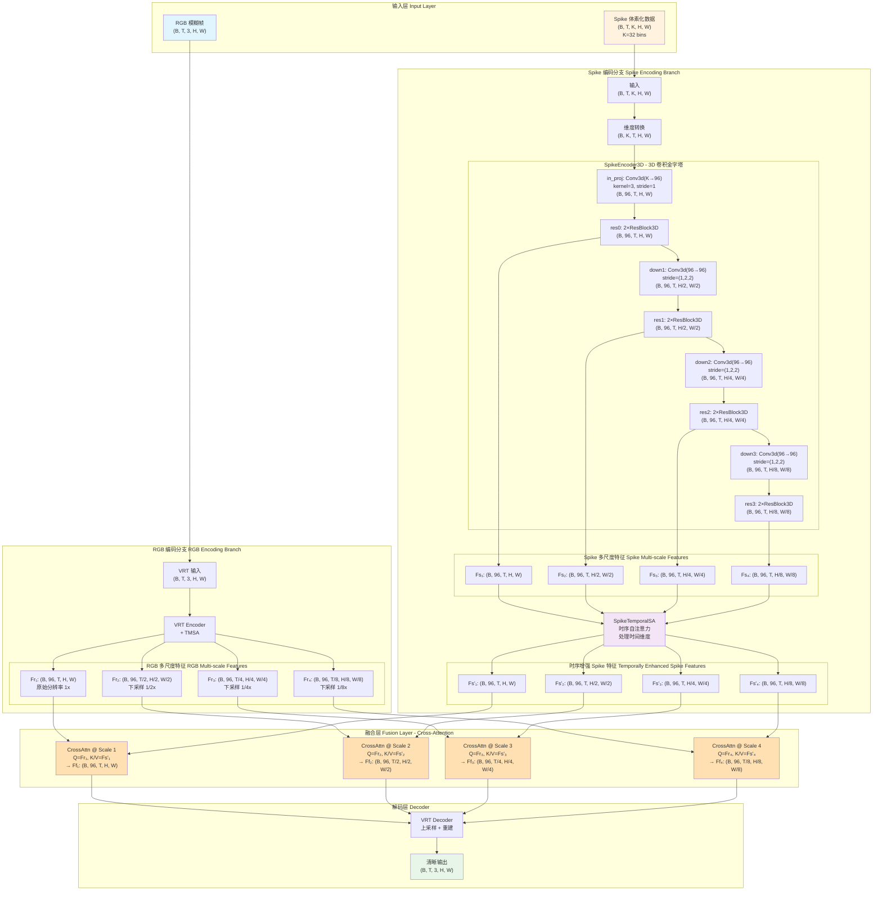

# VRT+Spike 架构数据流详解

本文档详细说明 VRT+Spike 视频去模糊模型的完整数据流，包括每个阶段的张量维度转换。

## 整体架构概览



## 关键设计要点

### 1. 输入数据

#### RGB 输入
- **形状**: `(B, T, 3, H, W)`
- **含义**: 
  - `B`: Batch size
  - `T`: 时间帧数（通常为 5 帧）
  - `3`: RGB 通道
  - `H, W`: 空间分辨率（例如 256×256）

#### Spike 输入
- **原始形状**: `(B, T, K, H, W)`
- **含义**:
  - `K`: 体素化 bins（固定为 32）
  - 每个 bin 代表一个时间窗口内的脉冲累积
- **預处理**: 在 SpikeEncoder3D 内部首先进行维度转换
  - `(B, T, K, H, W)` → `(B, K, T, H, W)`
  - 这样做是为了让 3D 卷积在 (C, T, H, W) 格式下工作

### 2. Spike 编码器 (SpikeEncoder3D)

#### 通道转换
第一层 `in_proj` 负责关键的通道维度转换：
```python
self.in_proj = nn.Conv3d(in_bins, c0, kernel_size=3, stride=1, padding=1)
# in_bins = K = 32 (spike 体素 bins)
# c0 = channels_per_scale[0] = 96 (与 VRT 特征通道对齐)
```

這个转换层的作用：
- **输入**: `(B, 32, T, H, W)` - 32 个时间 bins 的 spike 数据
- **输出**: `(B, 96, T, H, W)` - 96 通道特征（与 VRT 编码器第一阶段匹配）
- **学习目标**: 学习如何将密集的时间 bins 信息压缩为语义特征

#### 多尺度下采样策略

使用 **3D 卷积** 实现空间和时间维度的联合下采样：

| 尺度 | 空间步長 | 时间步長 | 空间分辨率 | 特征维度 |
|------|----------|----------|-----------|----------|
| Scale 1 (初始) | 1 | 1 | H×W | (B, 96, T, H, W) |
| Scale 2 | 2 | 1 | H/2×W/2 | (B, 96, T, H/2, W/2) |
| Scale 3 | 2 | 1 | H/4×W/4 | (B, 96, T, H/4, W/4) |
| Scale 4 | 2 | 1 | H/8×W/8 | (B, 96, T, H/8, W/8) |

**注意**：
- 默认配置下，时间维度保持不变（temporal_stride = 1）
- 只进行空间下采样（spatial_stride = 2）
- 每个尺度都使用 2 个 ResidualBlock3D 进行特征提煉

#### ResidualBlock3D 结构
```python
class ResidualBlock3D(nn.Module):
    """
    3D 残差块：
    x → Conv3d(3×3×3) → ReLU → Conv3d(3×3×3) → (+x) → ReLU
    """
```
- 使用 `kernel_size=3` 的 3D 卷积
- 保持空间和时间分辨率（stride=1, padding=1）
- 残差连接有助于梯度流动和特征保留

### 3. Spike 时序自注意力 (SpikeTemporalSA)

对每个尺度的 Spike 特征进行时间维度的 Self-Attention：

```
输入: Fs_i = (B, C, T, H, W)
处理: 沿时间維 T 进行 Self-Attention
      学习时序依赖关系和运动模式
输出: Fs'_i = (B, C, T, H, W)
```

**关键特性**：
- **多头注意力**: 默认 4 个注意力头
- **自适应分块 (Adaptive Chunking)**: 
  - 根据可用显存动态调整处理块大小
  - `MAX_BATCH_TOKENS: 49152`
  - `CHUNK_SIZE: 64`
  - `CHUNK_SHAPE: "square"`
- **MLP 扩展比**: 2×（在 FFN 中）

### 4. 跨模态融合 (Cross-Attention Fusion)

在每个尺度上使用 **Cross-Attention** 融合 RGB 和 Spike 特征：

```
Q (Query):    Fr_i  - RGB 特征（来自 VRT 编码器）
K/V (Key/Value): Fs'_i - 时序增强的 Spike 特征

Attention(Q, K, V) = softmax(QK^T / √d_k) V

输出: Ff_i = CrossAttn(Q=Fr_i, K/V=Fs'_i)
```

**为什么使用 Cross-Attention？**
- RGB 特征作为 Query：主动查询需要什么信息
- Spike 特征作为 Key/Value：提供高时间分辨率的运动线索
- 比简单拼接更灵活，能学习动态的跨模态交互

**实现细节**：
- **位置**: Monkey-patch VRT 的 `forward_features` 方法
- **时机**: 在 VRT 每个编码 Stage 之后注入融合
- **自适应分块**: 与 SpikeTemporalSA 相同的配置

### 5. VRT 解码器

接收融合后的多尺度特征 `Ff_1..4`，进行上采样和重建：

```
Ff_4 (1/8x) → 上采样 → Ff_3 (1/4x) → 上采样 → Ff_2 (1/2x) → 上采样 → Ff_1 (1x)
                                                                         ↓
                                                                   重建: (B,T,3,H,W)
```

## 维度追踪示例

假设输入配置：
- Batch size: `B = 2`
- 时间帧数: `T = 5`
- 空间分辨率: `H = W = 256`
- Spike bins: `K = 32`
- 特征通道: `C = 96`

### 完整数据流

```
阶段                               维度
────────────────────────────────────────────────────────
【输入】
RGB                                (2, 5, 3, 256, 256)
Spike                              (2, 5, 32, 256, 256)

【Spike 编码】
Permute                            (2, 32, 5, 256, 256)
in_proj                            (2, 96, 5, 256, 256)   ← Fs₁
  ↓ down1 (stride=1,2,2)
                                   (2, 96, 5, 128, 128)   ← Fs₂
  ↓ down2 (stride=1,2,2)
                                   (2, 96, 5, 64, 64)     ← Fs₃
  ↓ down3 (stride=1,2,2)
                                   (2, 96, 5, 32, 32)     ← Fs₄

【Spike 时序自注意力】
SpikeTemporalSA                    
  Fs₁ → Fs'₁                       (2, 96, 5, 256, 256)
  Fs₂ → Fs'₂                       (2, 96, 5, 128, 128)
  Fs₃ → Fs'₃                       (2, 96, 5, 64, 64)
  Fs₄ → Fs'₄                       (2, 96, 5, 32, 32)

【VRT 编码 + 融合】
VRT Stage 1                        (2, 96, 5, 256, 256)   ← Fr₁
  ↓ CrossAttn(Fr₁, Fs'₁)          (2, 96, 5, 256, 256)   ← Ff₁

VRT Stage 2                        (2, 96, 3, 128, 128)   ← Fr₂
  ↓ CrossAttn(Fr₂, Fs'₂)          (2, 96, 3, 128, 128)   ← Ff₂

VRT Stage 3                        (2, 96, 2, 64, 64)     ← Fr₃
  ↓ CrossAttn(Fr₃, Fs'₃)          (2, 96, 2, 64, 64)     ← Ff₃

VRT Stage 4                        (2, 96, 1, 32, 32)     ← Fr₄
  ↓ CrossAttn(Fr₄, Fs'₄)          (2, 96, 1, 32, 32)     ← Ff₄

【VRT 解码 + 重建】
VRT Decoder                        (2, 5, 3, 256, 256)    ← 最終输出
```

### 时间维度变化说明

注意到 VRT 编码器會逐渐**降低时间分辨率**：
- Stage 1: T=5
- Stage 2: T=3 (通过 TMSA 时间建模)
- Stage 3: T=2
- Stage 4: T=1 (压缩到瓶颈)

而 Spike 编码器**保持时间分辨率**：
- 所有 scales: T=5（默认 temporal_stride=1）

這种设计允许 Spike 特征在高时间分辨率下捕捉运动信息，即使 RGB 特征已经被时间压缩。

## 配置参数

### 典型配置（来自 `vrt_spike_baseline.yaml`）

```yaml
DATA:
  K: 32                    # Spike 体素化 bins
  CLIP_LEN: 5              # 时间帧数
  CROP_SIZE: 256           # 空间裁剪大小

MODEL:
  USE_SPIKE: true
  CHANNELS_PER_SCALE: [96, 96, 96, 96]  # 4个尺度的通道数
  
  SPIKE_TSA:               # Spike 时序自注意力
    HEADS: 4
    ADAPTIVE_CHUNK: true
    MAX_BATCH_TOKENS: 49152
    CHUNK_SIZE: 64
    CHUNK_SHAPE: "square"
  
  FUSE:                    # 跨模态融合
    TYPE: TemporalCrossAttn
    HEADS: 4
    ADAPTIVE_CHUNK: true
    MAX_BATCH_TOKENS: 49152
    CHUNK_SIZE: 64
    CHUNK_SHAPE: "square"
```

### 可调参数

#### Spike 编码器
- `temporal_strides`: 控制时间维度下采样（默认 [1,1,1]）
- `spatial_strides`: 控制空间维度下采样（默认 [2,2,2]）
- `channels_per_scale`: 各尺度的通道数（必須与 VRT 对齐）

#### 注意力模块
- `HEADS`: 多头注意力的头数（4-8）
- `DROPOUT`: Dropout 比例（0.0-0.1）
- `MLP_RATIO`: MLP 扩展比例（2-4）

#### 内存优化
- `ADAPTIVE_CHUNK`: 自适应分块以减少显存
- `MAX_BATCH_TOKENS`: 最大批次 tokens 数
- `USE_CHECKPOINT_ATTN`: VRT 注意力层梯度检查点
- `USE_CHECKPOINT_FFN`: VRT FFN 层梯度检查点

## 关键创新点

### 1. Spike 数据的有效利用
- **高时间分辨率**: Spike 相机提供微秒级时间分辨率
- **3D 卷积编码**: 联合处理時空信息
- **多尺度特征**: 与 VRT 各阶段精确对齐

### 2. 渐进式时序建模
- **Spike 分支**: 先用 3D 卷积提取時空特征，再用 Self-Attention 建模长期依赖
- **RGB 分支**: VRT 的 TMSA (Temporal Mutual Self-Attention) 处理时序
- **融合**: 在各自完成時域建模后进行 Cross-Attention

### 3. 灵活的跨模态融合
- **Cross-Attention 机制**: 动态学习跨模态交互
- **多尺度融合**: 在编码器的多个阶段注入 Spike 信息
- **Monkey-patch 设计**: 无需修改 VRT 原始代碼即可集成

### 4. 内存效率优化
- **自适应分块**: 动态调整处理块大小以适应显存限制
- **梯度检查点**: 在 VRT 的注意力和 FFN 层使用检查点
- **Flash Attention**: 加速注意力计算（如果可用）

## 参考实现

### 核心文件
- `src/models/integrate_vrt.py`: VRTWithSpike 主模型
- `src/models/spike_encoder3d.py`: SpikeEncoder3D 编码器
- `src/models/spike_temporal_sa.py`: SpikeTemporalSA 时序自注意力
- `src/models/fusion/cross_attn_temporal.py`: MultiScaleTemporalCrossAttnFuse 跨模态融合
- `src/train.py`: 训练脚本和模型初始化

### 相关文档
- `docs/CHANGES_SUMMARY.md`: 项目改动和修复总结
- `docs/CODE_VERIFICATION_REPORT.md`: 代碼验证报告
- `docs/核验.md`: 模型架构核验文档

---

**文档生成时间**: 2025-10-20
**作者**: AI Assistant
**版本**: v2.0


