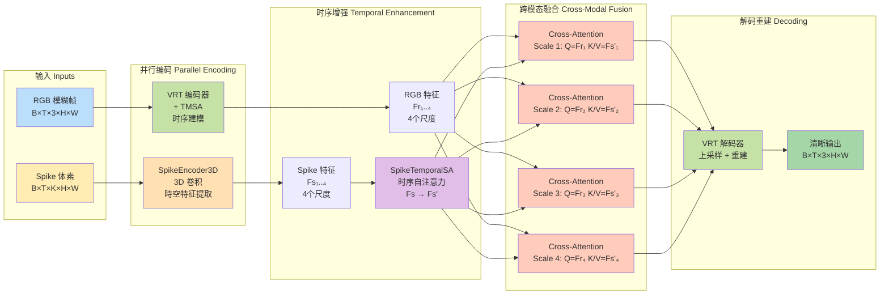
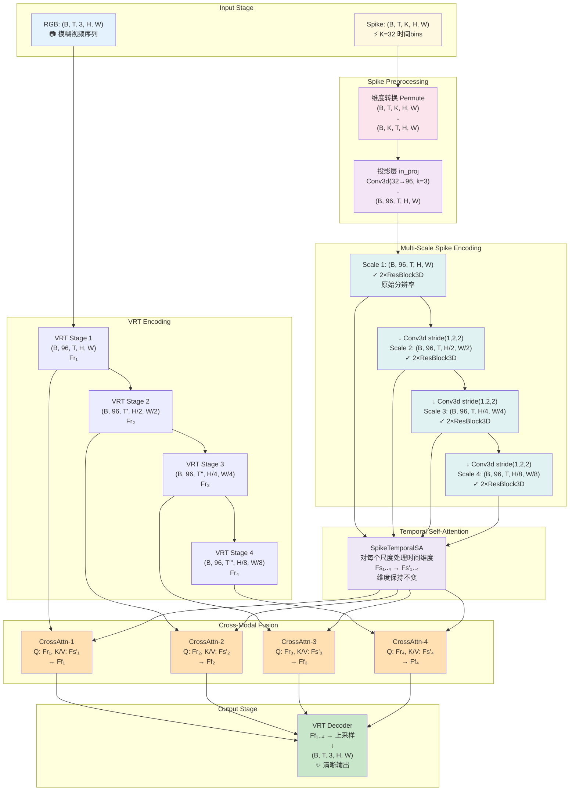
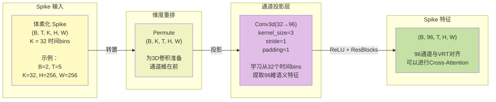
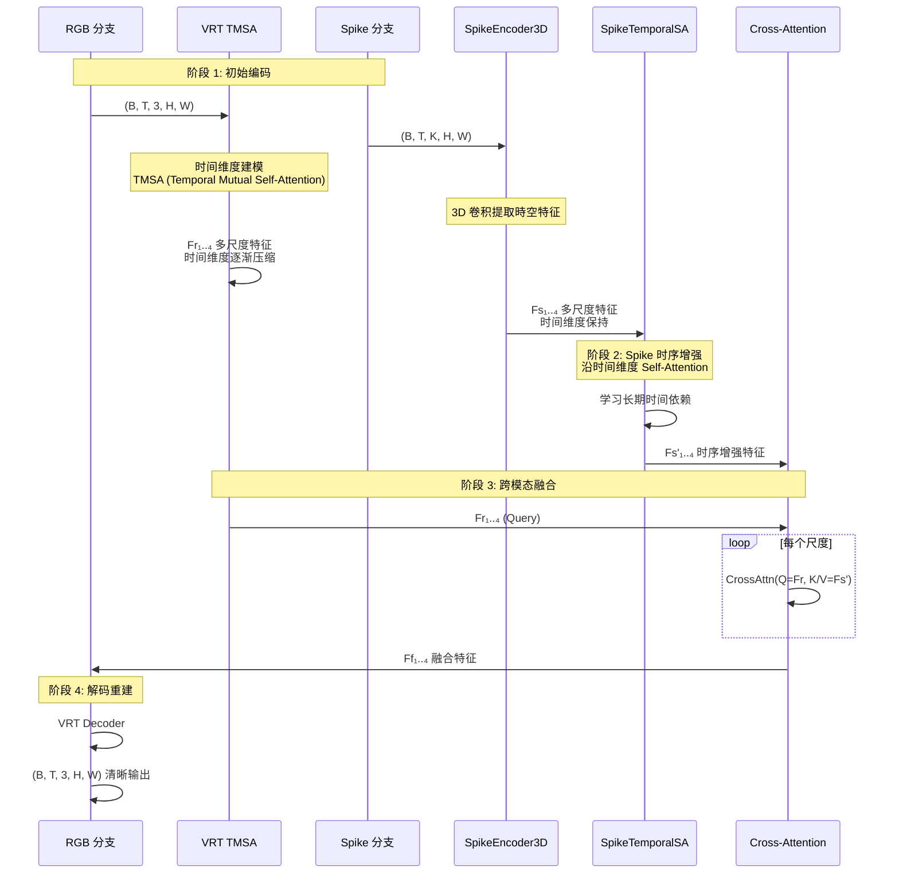
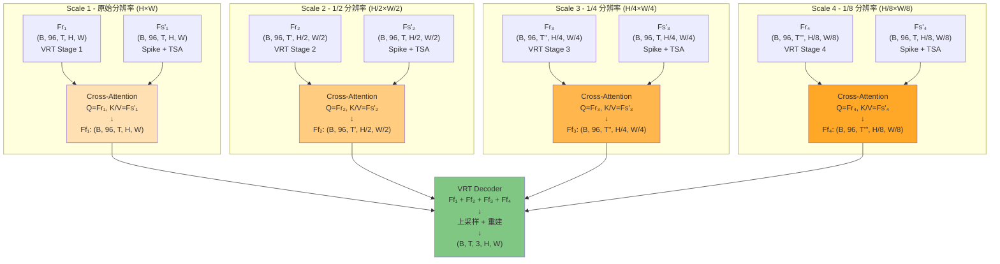

# VRT+Spike 架构可视化图集

本文档提供多种视角的架构可视化图，帮助理解模型的数据流和设计理念。

## 图表目录
1. [高层次架构图](#1-高层次架构图)
2. [详细数据流图](#2-详细数据流图)
3. [通道维度转换图](#3-通道维度转换图)
4. [时序处理流程图](#4-时序处理流程图)
5. [多尺度融合示意图](#5-多尺度融合示意图)

---

## 1. 高层次架构图

這个图展示了模型的核心组件和整体设计理念。



**设计理念**：
- 🔄 **并行处理**: RGB 和 Spike 各自进行時域建模
- 🎯 **渐进融合**: 在多个尺度上进行跨模态信息交互
- ⚡ **高效利用**: Spike 的高时间分辨率补充 RGB 的运动模糊区域

---

## 2. 详细数据流图

展示每个阶段的具體维度转换。



**注意事項**：
- VRT 的时间维度會逐渐压缩（T → T' → T'' → T'''）
- Spike 特征保持时间维度（默认 temporal_stride=1）
- 所有尺度的通道数对齐为 96

---

## 3. 通道维度转换图

聚焦于 Spike 数据如何从 K 个 bins 转换为特征通道。



**关键设计**：

1. **为什么是 32 bins？**
   - 平衡时间分辨率和计算成本
   - 足夠捕捉快速运动和模糊过程
   - 实验验证的最佳值

2. **为什么投影到 96 通道？**
   - 与 VRT 编码器的特征维度对齐
   - 便于后續的 Cross-Attention 融合
   - 足夠的表達能力而不过度参数化

3. **3D 卷积的优势**
   - 联合处理時空信息
   - 学习时间和空间的局部模式
   - 自然适配体素化的 Spike 数据

---

## 4. 时序处理流程图

对比 RGB 和 Spike 的时序建模策略。



**时序处理策略对比**：

| 特性 | RGB (VRT TMSA) | Spike (SpikeTemporalSA) |
|------|---------------|------------------------|
| **输入时间分辨率** | T 帧（例如 5 帧） | T 帧 × K bins（例如 5×32 = 160 个时间点） |
| **时间建模方式** | Mutual Self-Attention | Self-Attention |
| **时间维度变化** | 逐渐压缩（T→1） | 保持不变 |
| **建模目标** | 帧間运动和对齐 | 高频运动细节 |
| **计算位置** | VRT 编码器内部 | Spike 编码之后 |

**互补性**：
- RGB: 提供语义和结构信息，但时间分辨率有限
- Spike: 提供高时间分辨率的运动线索，弥补运动模糊

---

## 5. 多尺度融合示意图

展示 4 个尺度上的 Cross-Attention 融合机制。



**Cross-Attention 机制细节**：

```
对于每个尺度 i：

1. Query: Fr_i  (来自 VRT RGB 编码)
   - 形状: (B, C, T', H_i, W_i)
   - 含义: "RGB 特征想知道什么信息？"

2. Key/Value: Fs'_i  (来自 Spike + TSA)
   - 形状: (B, C, T, H_i, W_i)
   - 含义: "Spike 能提供什么运动线索？"

3. Attention 计算:
   Q_flat = rearrange(Fr_i, "b c t h w -> b (t h w) c")
   K_flat = rearrange(Fs'_i, "b c t h w -> b (t h w) c")
   V_flat = rearrange(Fs'_i, "b c t h w -> b (t h w) c")
   
   Attention = softmax(Q_flat @ K_flat^T / sqrt(d_k))
   Out_flat = Attention @ V_flat
   
   Ff_i = rearrange(Out_flat, "b (t h w) c -> b c t h w")

4. 输出: Ff_i
   - 形状: (B, C, T', H_i, W_i)
   - 含义: RGB 特征增强了 Spike 的运动信息
```

**为什么多尺度融合？**
- **尺度 1 (高分辨率)**: 捕捉精细的运动细节和边缘
- **尺度 2-3 (中分辨率)**: 平衡细节和全局上下文
- **尺度 4 (低分辨率)**: 提供全局运动模式和场景理解

---

## 附录：3D 卷积可视化

### ResidualBlock3D 结构

```
输入: x ∈ ℝ^(B×C×T×H×W)
  ↓
Conv3d(C→C, kernel=3×3×3, stride=1, padding=1)
  ↓
ReLU
  ↓
Conv3d(C→C, kernel=3×3×3, stride=1, padding=1)
  ↓
  ⊕ ← x (residual connection)
  ↓
ReLU
  ↓
输出: y ∈ ℝ^(B×C×T×H×W)
```

### 3D 卷积的感受野

```
單个 3×3×3 卷积核：
- 时间维度: 3 个时间步
- 空间维度: 3×3 空间区域

经过 N 个残差块后：
- 时间感受野: 2N + 1
- 空间感受野: 2N + 1

例如，2 个 ResBlock3D：
- 时间感受野: 5 个时间步
- 空间感受野: 5×5 像素
```

---

## 总结

### 架构优势

1. **多模态互补** 🔄
   - RGB 提供语义和结构
   - Spike 提供高时间分辨率的运动信息

2. **渐进式融合** 🎯
   - 各模态先獨立完成時域建模
   - 多尺度上进行跨模态信息交互
   - 充分发挥各自优势

3. **灵活性** ⚙️
   - 可调节的通道数和尺度数
   - 支持自适应分块以适应显存限制
   - Monkey-patch 设计便于集成

4. **效率优化** ⚡
   - 3D 卷积高效处理時空数据
   - 梯度检查点减少显存占用
   - Flash Attention 加速（如果可用）

### 关键创新

- ✨ **时序先行**: 兩个分支各自完成时间建模后再融合
- 🎨 **Cross-Attention**: 动态学习跨模态交互，比拼接更灵活
- 🔬 **多尺度**: 在编码器的多个阶段注入 Spike 信息
- 💾 **内存高效**: 自适应分块 + 梯度检查点

---

**参考资料**：
- 主实现: `src/models/integrate_vrt.py`
- 详细文档: `docs/architecture_dataflow.md`
- 配置示例: `configs/deblur/vrt_spike_baseline.yaml`

**生成时间**: 2025-10-20  
**版本**: v2.0


